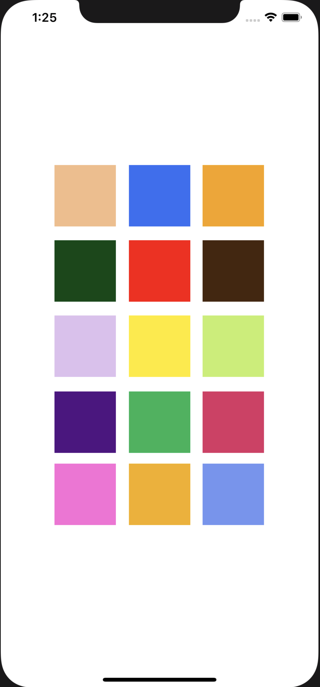

# drum-pad

## About
A drum pad interface built in Swift

## Screenshot 
 
 
    
 

## Going Forward
Design a better UI and allow for drum pads to have their preset sounds changed. This can be done by having a having a database filled with .wav files.

